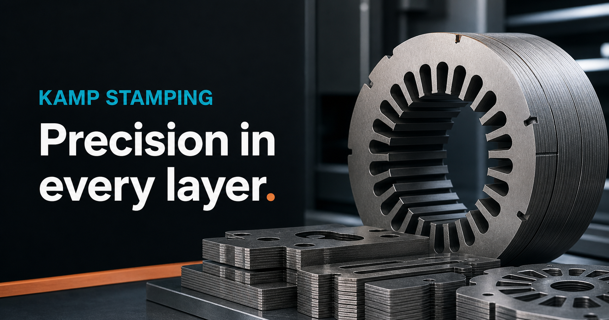

# KAMP Stamping Website



A modern public website for KAMP Stamping Pvt. Ltd., an electrical-stamping and
motor-component manufacturer based in Bhiwadi, Rajasthan.

The site presents KAMP's manufacturing capabilities, representative products,
company history, contact details, and a public Copper Buying Guide for
manufacturing and purchasing teams.

## Highlights

- Responsive industrial design for desktop and mobile
- Manufacturing capabilities and product catalogue
- Original KAMP factory and component photography
- Public Copper Buying Guide embedded as a supporting resource
- Search metadata, sitemap, social-sharing artwork, and legacy URL redirects
- Static production output designed for Netlify hosting

## Technology

- Next.js
- React
- TypeScript
- Static export
- Netlify

## Run locally

Requires Node.js 22 or newer and pnpm.

```bash
pnpm install
pnpm run dev
```

Create a production build:

```bash
pnpm run build
```

The static website is generated in `out/`.

## Deployment

Netlify reads the build configuration from `netlify.toml`. Updates to the
production branch can be built and published automatically after the repository
is connected to the Netlify project.

## Ownership

Website content and imagery © KAMP Stamping Pvt. Ltd.
